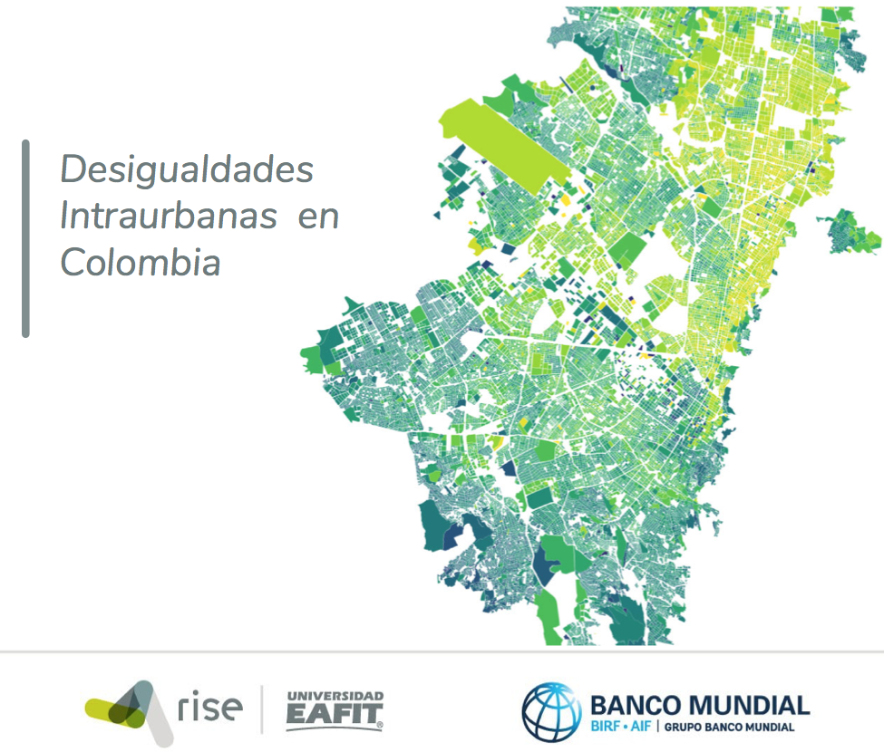

<pre>
<p float="left">

               
         
</p>
</pre>

# Las desigualdades intraurbanas en Colombia.


Juan C. Duque<sup>1</sup>, Nancy Lozano-Garcia<sup>2</sup>, Mauricio Quiñones, Gustavo A. García, Juan P. Ospina, Jorge E. Patino<sup>1</sup>, Kelly Y. Montoya


<sup>1</sup> RiSE-group, Department of Mathematical Sciences, Universidad EAFIT, Medellin, Colombia

<sup>2</sup> The World Bank. Washington, USA.


__maintainer__ = "RiSE Group"  (http://www.rise-group.org/). Universidad EAFIT

__Corresponding author__ = jduquec1@eafit.edu.co



## Descripción:
Este repositorio contiene los datos de la investigación titulada “Desigualdades Intraurbanas en Colombia” realizada por el grupo RiSE en el marco del proyecto “Support to the Territorial and Urban Development Agenda in LAC” financiado por el Banco Mundial.
La investigación cubre tres dimensiones: La desigualdad socioeconómica, la desigualdad en accesibilidad y un análisis sobre posibles mejoras al sistema de estratificación socioeconómica.  

### Bibtext entry:

```tex

@misc{urbanIneq2020,
  author = {RiSE-group},
  title = { Intra-urban inequalities in Colombia },
  year = {2020},
  note = {data retrieved from RiSE-group, 
          \url{https://github.com/Rise-group/desigualdades_intraurbanas_Colombia}},
}

```
